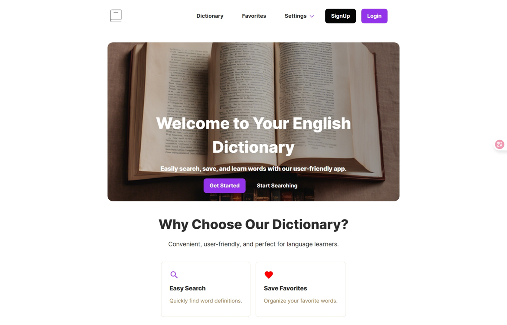
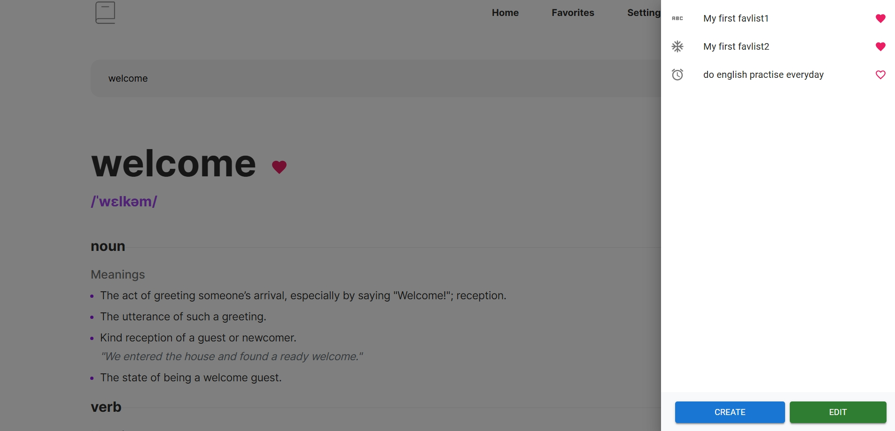

# Dictionary App (MEVN Stack)

這是一個以 MEVN（MongoDB、Express.js、React.js、Node.js）為技術基礎所打造的英文字典網頁，提供使用者註冊/登入使用，並且能透過字典查詢英文單字、收藏單字、管理收藏清單，並且能進入收藏夾查看收藏的單字。

## 目錄

- [技術](#技術)
- [專案畫面截圖](#專案畫面截圖)
- [專案結構](#專案結構)
- [LiveSite](#LiveSite)
- [作者資訊](#作者資訊)

## 技術

Frontend: React + Vite + React Router

Styling: TailwindCSS + MUI + Scss

Backend: Node.js + Express.js

Database: MongoDB (Mongoose ODM)

Auth: Passport.js

## 功能特色

### 使用者功能

- 註冊 / 登入驗證

### 字典功能

- 搜尋
- 檢視單字各詞性定義/發音
- 檢視收藏狀態

### 收藏功能

- 建立/管理收藏清單
- 收藏單字
- 收藏夾頁面單字管理

## 專案結構

```
Dictionary-App_vercel/
├── server/
│ ├── models/
│ ├── routes/
│ ├── controllers/
│ ├── server.js
│ └── package.json
│
├── client/
│ ├── src/
│ │ ├── apis/
│ │ ├── types/
│ │ ├── utils/
│ │ ├── components/
│ │ ├── assets/
│ │ ├── hooks/
│ │ ├── pages/
│ │ ├── utils/
│ │ └── main.jsx
│ ├── vite.config.js
│ └── package.json
│
└── README.md
```

## 專案畫面截圖

### 首頁



### 字典頁面




### 登入頁面


### 收藏夾頁面


## LiveSite

- GitHub - [Repository](https://github.com/Benson0721/Dictionary_App_frontend_vercel)
- Live Site - [Dictionary App](https://dictionary-app-frontend-vercel.vercel.app/)

## 作者資訊

- 作者：Benson
- 前端學習者-以成為一名前端工程師為目標!
- 作品集： [Notion](https://www.notion.so/Front-End-layout-Portfolio-1c4acba779c38053a9dcf4b1caa7af0c)/[Cake](https://www.cake.me/a092468579/portfolios)
- Email：a092468579@gmail.com
